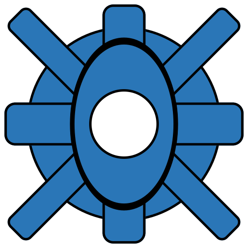

# Web Portal

Web Portal is a all-in-one web dashboard, providing many widgets to build a personal portal. With the ability to load external plugins.

It has been designed to run through docker and it is recommended to put it behind a proxy like Nginx for custom routing and domain names.

If you want just a basic link panel configured with a yaml file checkout Web Portal Lite available here: <https://github.com/enchant97/web-portal-lite>.

## Features
- Minimal use of Javascript, to provide a lightning fast experience
- Icon based UI
- Minimal docker image (if deployed with docker)
- Adjustable site theme
- Plugin support
- Inbuilt Plugin Widgets
  - Core
    - Digital Clock
    - Links
      - Groups
      - Colors
      - Icons
    - Search bar
  - Core-Extras
    - HTML embed
    - Website embed (through iframe)
- Password protection for admin modification
- Optionally secure the portal with user accounts & passwords
- MySQL & SQLite support

## Showcase

## Demo Video
WIP

## Third-Party Plugins
It is encouraged to extend and build upon this app to make it the ultimate dashboard.

Here are some ideas:
- Server status widget
- Home Automation
- Messages widget (leave messages for users)

You can discuss plugins [here](https://github.com/enchant97/web-portal/discussions/categories/third-party-plugins).

## Branches
| Name         | Description            | State         |
| :----------- | :--------------------- | :------------ |
| main         | Work ready for release | Stable        |
| next         | Work for next version  | Very Unstable |
| historical-X | Historical versions    | Unsupported   |

> Choose a tag/release for most stable if running project

## Contributions
Contributing to this project is welcome, whether that is an issue or pull request, but please read the guidelines below:

- Contributions may get rejected, if they do not fit the project
- New widgets most likely will not be added, instead make a plugin (feel free to add the idea to the GitHub discussions page, [here](https://github.com/enchant97/web-portal/discussions/categories/ideas))
- You should keep code to this existing style/format
- Contributions should not require more pip packages from being added, although there may be exceptions
- Contributions must be licensed under the same as the project
- Submit pull requests to 'next' branch, please include some details of what the Contribution is
- Don't change the version number

## Documentation
More details and guides on installing can be found at: [webportal.docs.enchantedcode.co.uk/](https://enchantedcode.co.uk/web-portal/) or view the markdown in the `docs` folder [here](docs/index.md).

## License
This project is Copyright (c) 2024 Leo Spratt, licences shown below:

Code

    AGPL-3 or any later version. Full license found in `LICENSE.txt`

Documentation

    FDLv1.3 or any later version. Full license found in `docs/LICENSE.txt`

This project also uses some third party content, licences for those are found at: `THIRD-PARTY.txt`.
