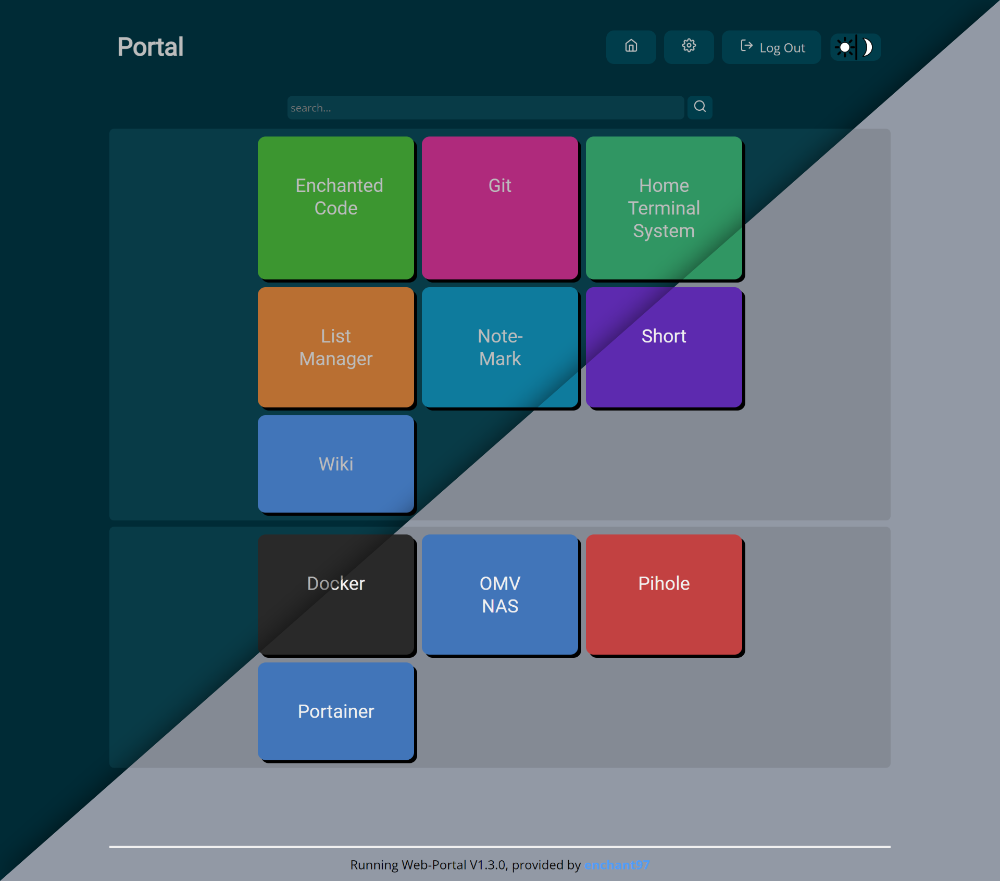

# Home
Welcome to the Web-Portal docs. The documentation is split into two sections one for users and the other for developers.

## What Is Web Portal?
Web Portal is a all-in-one web dashboard, providing many widgets to build a personal portal. With the ability to load external plugins.

> If you want just a basic link panel configured with a yaml file checkout Web Portal Lite available here: <https://github.com/enchant97/web-portal-lite>.

## State Of Project
I currently find it feature complete and do not find myself needing any more features. I will still perform bug fixes and security patches when required.

### Can I still suggest a feature?
Of course! However, I may not implement it. But I will accept contributions.

## Features
- Minimal use of JavaScript, to provide a lightning fast experience
- Icon based UI
- Minimal docker image (if deployed with docker)
- Adjustable site theme
- Configurable background image
- Plugin support
- Inbuilt Plugin Widgets
    - Core
        - Digital Clock
        - Links
            - Groups
            - Colors
            - Icons
        - Search bar
    - Core-Extras
        - HTML embed
        - Website embed (through iframe)
- Password protection for admin modification
- Optionally secure the portal with user accounts & passwords
- MySQL & SQLite support

## Showcase

## Third-Party Plugins
It is encouraged to extend and build upon this app to make it the ultimate dashboard.

Here are some ideas:
- Server status widget
- Home Automation
- Messages widget (leave messages for users)

You can discuss plugins [here](https://github.com/enchant97/web-portal/discussions/categories/third-party-plugins).

## Guide Links
- [For Users](users/index.md)
- [For Developers](developers/index.md)
- [Project Repository](https://github.com/enchant97/web-portal)
