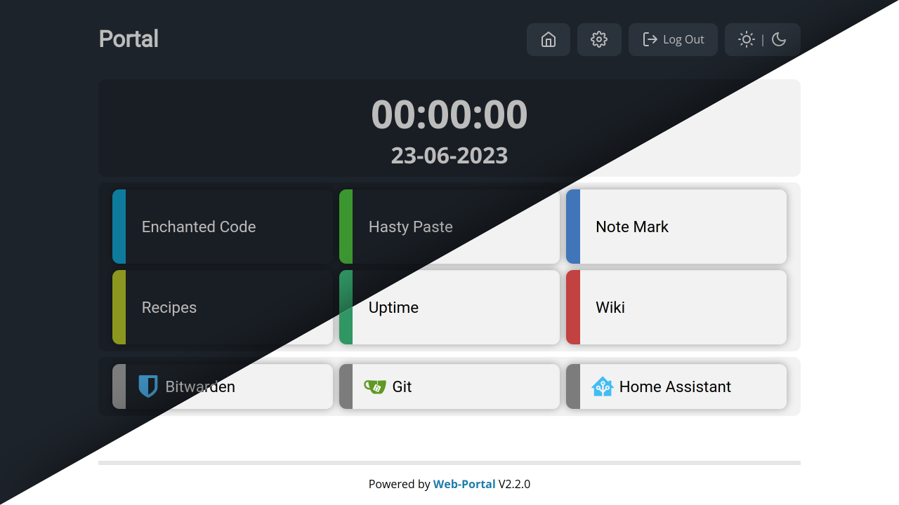

# Home
Welcome to the Web-Portal docs. The documentation is split into two sections one for users and the other for developers.

## What Is Web Portal?
Web-Portal is a web app written in Python using Quart, that aims to provide an easy and fast way to manage the links to all of your web services.

> If you want just a basic link panel configured with a yaml file checkout Web Portal Lite available here: <https://github.com/enchant97/web-portal-lite>.

## Features
- Minimal use of Javascript, to provide a lightning fast experience
- Icon based UI
- Minimal docker image (if deployed with docker)
- Adjustable site theme
- Plugin support
- Inbuilt widgets
  - Digital Clock
  - Links
    - Groups
    - Colors
    - Icons
  - Search bar
  - HTML embed
  - Website embed (through iframe)
- Password protection for admin modification
- Optionally secure the portal with user accounts & passwords
- MySQL/MariaDB and SQLite support

## Showcase

## Guide Links
- [For Users](users/index.md)
- [For Developers](developers/index.md)
- [Project Repository](https://github.com/enchant97/web-portal)
